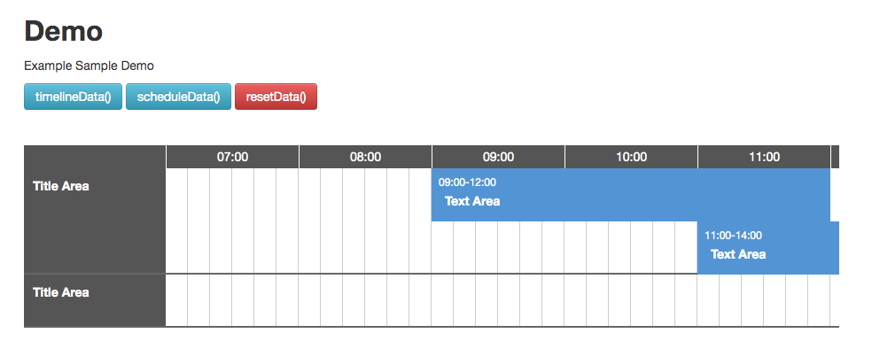

jq.Schedule
===============

[](https://badge.fury.io/js/jq.schedule)
[](https://travis-ci.com/ateliee/jquery.schedule)




jquery and html schedule calendar

* Drag and Drop Support
* Resize Schedule
* Ajax Get Data

## install

### package
```
npm i jq.schedule --save
```

## Demo

[Try Demo](https://ateliee.github.io/jquery.schedule/demo/)

## How to use

append head css
```
<link rel="stylesheet" type="text/css" href="./jquery.schedule/dist/css/style.min.css" />
```

insert body
```
<div id="schedule"></div>
<script type="text/javascript" src="./jquery.schedule/dist/js/jq.schedule.min.js"></script>
<script type="text/javascript">
    $(function(){
        var $sc = $("#schedule").timeSchedule({
            startTime: "07:00", // schedule start time(HH:ii)
            endTime: "21:00",   // schedule end time(HH:ii)
            widthTime:60 * 10,  // cell timestamp example 10 minutes
            timeLineY:60,       // height(px)
            verticalScrollbar:20,   // scrollbar (px)
            timeLineBorder:2,   // border(top and bottom)
            bundleMoveWidth:6,  // width to move all schedules to the right of the clicked time line cell
            rows : {
                '0' : {
                    title : 'Title Area',
                    subtitle : 'Description',
                    schedule:[
                        {
                            start:'09:00',
                            end:'12:00',
                            text:'Text Area',
                            data:{
                            }
                        },
                        {
                            start:'11:00',
                            end:'14:00',
                            text:'Text Area',
                            data:{
                            }
                        }
                    ]
                },
                '1' : {
                    title : 'Title Area',
                    schedule:[
                        {
                            start:'16:00',
                            end:'17:00',
                            text:'Text Area',
                            data:{
                            }
                        }
                    ]
                }
            },
            onChange: function(node, data){
                addLog('onChange', data);
            },
            onInitRow: function(node, data){
                addLog('onInitRow', data);
            },
            onClick: function(node, data){
                addLog('onClick', data);
            },
            onAppendRow: function(node, data){
                addLog('onAppendRow', data);
            },
            onAppendSchedule: function(node, data){
                addLog('onAppendSchedule', data);
            },
            onScheduleClick: function(node, time, timeline){
                addLog('onScheduleClick', time + ' ' + timeline);
            }
        });
    });
</script>
```

## Options

### Paramaters

|Key|Value|Description|
|---|------|----------|
|className|jq-schedule|add elemnt class(default jq.schedule)|
|startTime|07:00|schedule start time(HH:ii)|
|endTime|21:00|schedule end time(HH:ii)|
|widthTime|600|cell timestamp example 10 minutes|
|timeLineY|60|height(px)|
|verticalScrollbar|20|scrollbar (px)|
|timeLineBorder|2|border(top and bottom)|
|bundleMoveWidth|6|width to move all schedules to the right of the clicked time line cell|
|rows|{object}|schedule data|
|draggable|{boolean}|enable draggable(default true)|
|resizable|{boolean}|enable resizable(default true)|
|resizableLeft|{boolean}|enable left handle resizable(default false)|

### Schedule Data

|Key|Type|Description|
|---|----|-----|
|title|string|Schedule Row Title|
|subtitle|string|Schedule Row Description|
|schedule|object[]|schedule row of array|

### Schedule Data in Object

|Key|Type|Description|
|---|----|-----|
|start|string|HH:ii|
|end|string|HH:ii|
|text|string|Bar Title|
|data|object|bind data|

### Callback Methods

#### onChange(node: Element, data: Object)
on change schedule bar callback

#### onInitRow(node: Element, data: Object)
initialize data

#### onClick(node: Element, data: Object)
on click bar callback

#### onAppendRow(node: Element, data: Object)
on add schedule row callback

#### onSppendSchedule(node: Element, data: Object)
on add schedule bar callback

#### onScheduleClick(node: Element, time: string, data: Object)
on click schedule row callback

### Methods

#### get row data
```
var data = $("#schedule").timeSchedule('timelineData');
```

#### get schedule data
```
var data = $("#schedule").timeSchedule('scheduleData');
```

#### clear all data
```
$("#schedule").timeSchedule('resetData');
```

#### clear all data and row
```
$("#schedule").timeSchedule('resetRowData');
```

#### add row
```
$("#schedule").timeSchedule('addRow', timeline, {
    title : 'Title Area',
    schedule:[
        {
            start:'09:00',
            end:'12:00',
            text:'Text Area',
            data:{
            }
        }
    ]
});
```

#### add data
```
$("#schedule").timeSchedule('addSchedule', timeline, {
    start: start,
    end: end,
    text:'Insert Schedule',
    data:{}
});
```

#### switch setting
```
$("#schedule").timeSchedule('setDraggable', true or false);
```
```
$("#schedule").timeSchedule('setResizable', true or false);
```

## For Development

run server browser-sync
```
npm run serve
```

